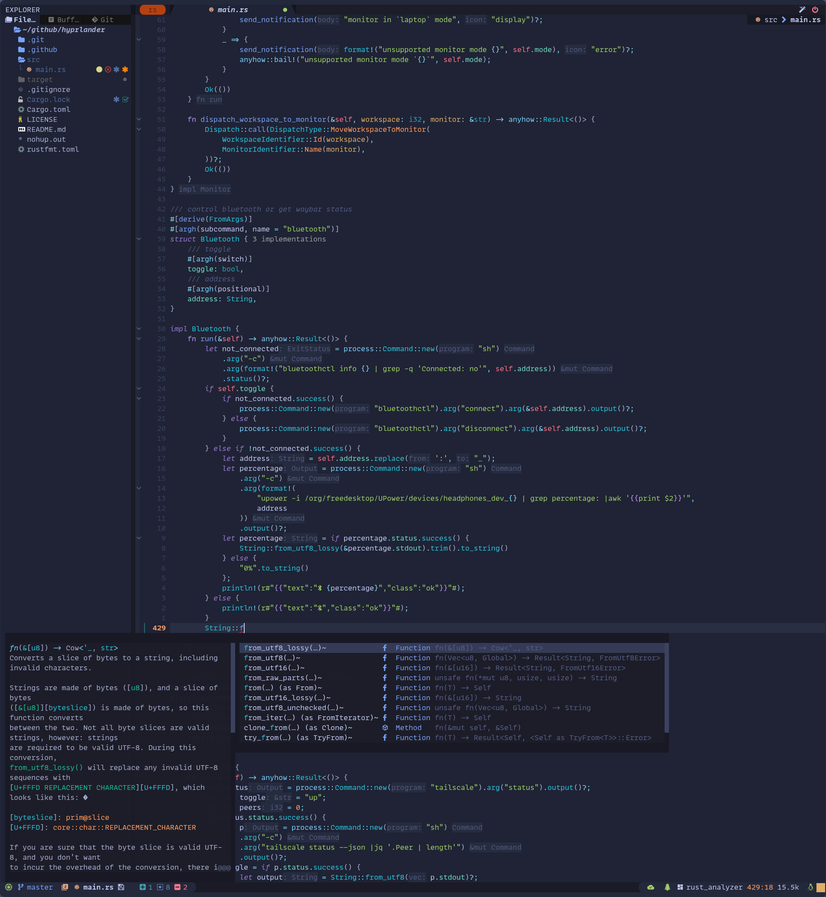

# Deprecated in favour of https://github.com/crisidev/lazyvim - See https://lmno.lol/crisidev/lunarvim-lazyvim

## 🤟 Crisidev Neovim Configs 🤟

Personal Neovim configuration based on LunarVim.

Take what you need, it also comes warrant free 😊

### Look and feel



### Info

* My config is heavy and extremely personalized for my needs and it will probably not work for
  you out of the box.. **Take it as an inspiration**.
* I am usually up to date with Neovim HEAD.
* My config is heavily based on the great work of [abzcoding](https://github.com/abzcoding/lvim).

### Installation

```sh
❯❯❯ git clone https://github.com/andsens/homeshick.git $HOME/.homesick/repos/homeshick
❯❯❯ git clone https://github.com/crisidev/lvim.git $HOME/.homesick/dotfiles
❯❯❯ source "$HOME/.homesick/repos/homeshick/homeshick.sh"
❯❯❯ homeshick link lvim
```

### Update mason-ensure-installed

```sh
❯❯❯ echo "$(cat ~/.local/state/lvim/mason.log |grep "Installation succee" |awk -F'for Package' '{print $2}' |sed 's/(name=//g'| sed 's/)//g' | sort -u |xargs)" > ~/.config/lvim/mason-ensure-installed
```

### Update Mason installed plugins

```sh
❯❯❯ vim "+MasonInstall $(cat ~/.config/lvim/mason-ensure-installed)"
```
